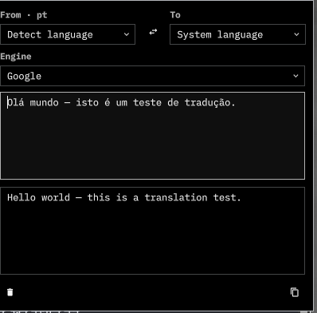

# Translate



Translate selected, copied, or on-screen text from the Omarchy bar. The
panel auto-detects the source language and translates into the **system
language** (`LANG` / `LC_MESSAGES`), with optional pinned pairs, history,
speech, OCR, and paste-back.

This is a Quattro `bar-widget`. The compact popup is loaded by the bar
widget. It runs inside the existing `omarchy-shell` process.

License: [MIT](LICENSE).

## Install

```sh
omarchy plugin add https://github.com/antunesales-dev/omarchy-translate.git --enable
```

Install does **not** change Hyprland keybindings or other user config.
Optional binds and menu rows live in [`extras/`](extras/).

## Usage

**Type:** click the bar icon. The panel opens empty.

**Selection:** copy (`SUPER + C` or `SUPER + SHIFT + T`), then the panel
translates automatically.

**On-screen text (OCR):** `SUPER + SHIFT + PRINT` (optional bind) draws a
region, reads it with Tesseract, and opens the panel.

**Compact popup:** `SUPER + SHIFT + ALT + T` (optional bind).

In the panel:

- Swap languages **and** text, or pin the current pair.
- Recent targets appear first (★).
- Speak original or translation (Google TTS, then `espeak-ng`).
  LibreTranslate stays local and uses `espeak-ng`.
- Paste the translation into the focused app.
- Toggle auto-copy and clipboard watch (dot on the bar icon when the
  clipboard looks like another language).
- History of the last 20 translations.
- Long text scrolls (wheel, scrollbar, Page Up/Down).

Press **F1**, **Ctrl+/**, or the **?** button in the panel for the in-app
guide (what it does, engines, privacy, and every shortcut).

Optional keybinds: copy
[`extras/bindings.lua.example`](extras/bindings.lua.example) into
`~/.config/hypr/bindings.lua`. Menu rows:
[`extras/omarchy-menu.jsonc`](extras/omarchy-menu.jsonc).

```sh
omarchy-shell shell summon io.github.antunesales-dev.translate '{}'
omarchy-shell io.github.antunesales-dev.translate-popup open
omarchy-translate-ocr
```

## Configure

```sh
omarchy bar move io.github.antunesales-dev.translate --section right
```

| Setting | Default | Meaning |
|---|---|---|
| `sourceLang` | `auto` | Detect the source language |
| `targetLang` | `auto` | System language (`en_US` → `en`) |
| `pairPinned` | `false` | Keep the current from/to pair |
| `engine` | `google` | `google`, `mymemory`, or `libretranslate` |
| `grab` | `clipboard` | `clipboard`, `primary`, or `auto` |
| `copyResult` | `false` | Copy the translation as soon as it arrives |
| `watchClipboard` | `false` | Hint on the bar when clipboard language differs |
| `recentTargets` | `[]` | JSON array of recent target codes |
| `libretranslateUrl` | `http://127.0.0.1:5000` | LibreTranslate base URL |
| `libretranslateKey` | empty | Optional API key |

History is stored in `~/.config/omarchy-translate/history.json`.
Copy [`config/glossary.example.json`](config/glossary.example.json) to
`~/.config/omarchy-translate/glossary.json` to keep extra names untranslated.

Same-language text is not sent to a translator. URLs, emails, and common
API tokens are redacted before a network call. Translations are cached
locally for a week. Drop a `.txt` or `.srt` file on the panel to
translate it. The document icon OCRs a screen region.

## Engines

If Google or MyMemory fails, the helper tries the other remote engine
unless you pass `--no-fallback`. **LibreTranslate never falls back** to
Google or MyMemory — a down local instance is an error, not a leak.

The LibreTranslate API key is read from a 0600 file under
`$XDG_RUNTIME_DIR` or `OMARCHY_TRANSLATE_LT_KEY`, never from process
arguments. Copy uses `omarchy-translate copy --file`, so the
translation is not visible in `ps`. Speak uses Google TTS when the
engine is Google or MyMemory, then `espeak-ng`. LibreTranslate speak
stays local.

| Engine | What it is | Off-machine |
|---|---|---|
| **google** (default) | Unofficial free `translate.googleapis.com` (`client=gtx`) | Yes |
| **mymemory** | Free Translated.net API, ~5k chars/day | Yes |
| **libretranslate** | Open-source Argos Translate | Only if the URL is remote |

Point Engine at a LibreTranslate URL you already run (default
`http://127.0.0.1:5000`). Only `http`/`https` URLs are accepted. This
plugin does not start Docker.

Lists, blank-line paragraphs, and simple HTML tags are preserved when
translating.

## Dependencies

Typical Omarchy already has Python 3.11+, `wl-clipboard`, `grim`,
`slurp`, `tesseract`, and `wtype`.

Optional:

- `espeak-ng` — local fallback when speaking with LibreTranslate, or if
  Google TTS is unavailable.
- extra Tesseract language data for OCR besides English

```sh
bin/omarchy-translate --json --text "Olá mundo"
bin/omarchy-translate detect --json --text "Bonjour"
bin/omarchy-translate history
```

## Privacy

Runs unsandboxed inside `omarchy-shell`. Default engine sends text to
Google over HTTPS. Use local LibreTranslate to keep text on-machine —
detection and translation both stay on that instance, with no Google or
MyMemory fallback. Scratch files go under `$XDG_RUNTIME_DIR/omarchy-translate`
(mode 0700), not world-readable `/tmp`. Clipboard watch, when enabled,
inspects new clipboard text to detect language.

## Tests

```sh
python3 -m unittest discover -s tests -v
```

## Remove

```sh
omarchy plugin remove io.github.antunesales-dev.translate
```

That does not revert keybinds you added yourself.

## License

[MIT](LICENSE) © 2026 Tiago Sales
